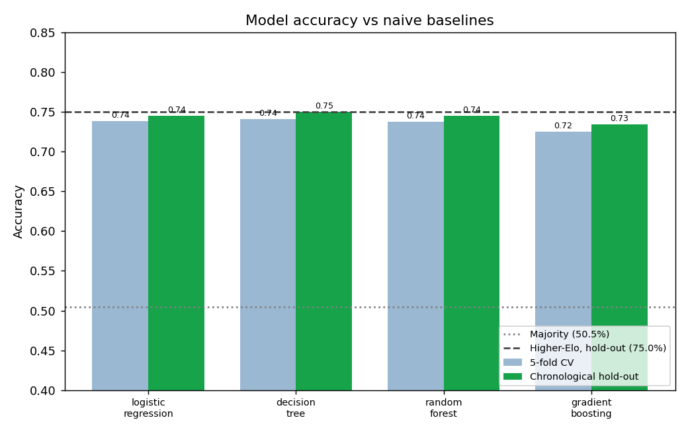
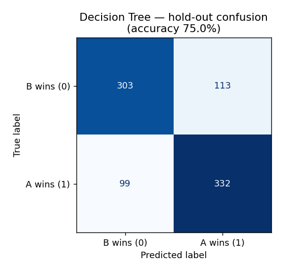
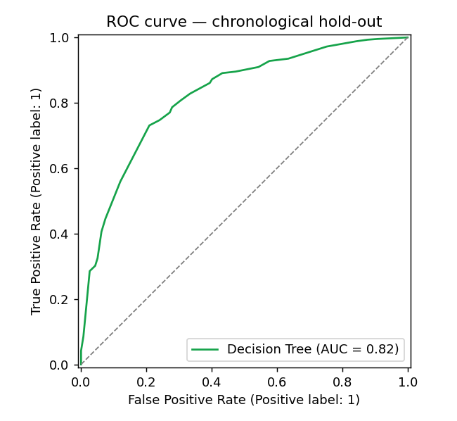
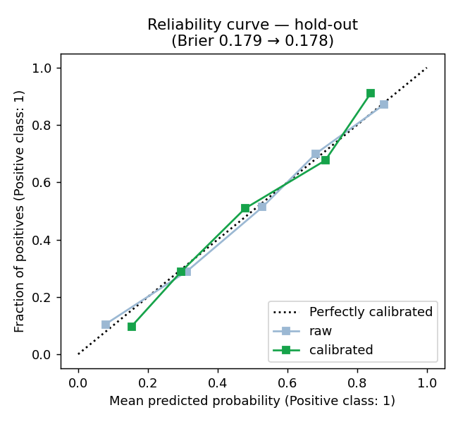
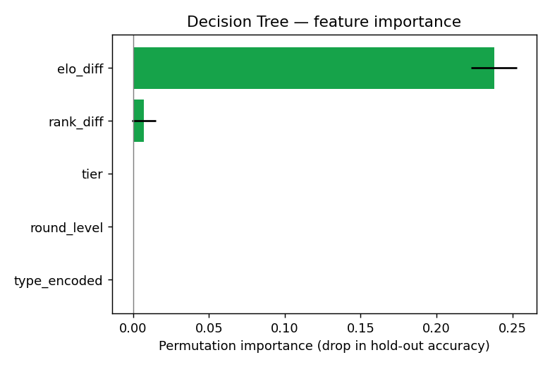

# Badminton Predictor — Training Report

_Generated 2026-06-09T14:04:05+00:00 · 4231 unique matches · leakage-free point-in-time features_

**Features:** `rank_diff, elo_diff, round_level, type_encoded, tier`  
**Best model:** Decision Tree · calibrated (Platt)  
**Selected by:** chronological hold-out accuracy (forecasting the most recent matches)  
**Headline accuracy (chronological hold-out):** 75.0%  
**5-fold CV accuracy (same model):** 74.1%

## Baselines to beat

- Majority class: **50.5%**
- Higher-Elo-wins (full / hold-out): **74.0%** / **75.0%**
- Better-rank-wins (full / hold-out): **72.5%** / **73.9%**

## Cross-validation (5-fold)

| Model | Accuracy | ROC-AUC | Brier |
|---|---|---|---|
| logistic_regression | 0.738 ± 0.011 | 0.813 | 0.176 |
| decision_tree | 0.741 ± 0.010 | 0.806 | 0.179 |
| random_forest | 0.737 ± 0.010 | 0.808 | 0.179 |
| gradient_boosting | 0.725 ± 0.018 | 0.798 | 0.185 |
| baseline_majority | 0.505 ± 0.000 | 0.500 | — |
| baseline_higher_elo | 0.740 ± 0.000 | — | — |
| baseline_better_rank | 0.725 ± 0.000 | — | — |

## Chronological hold-out (train on oldest 80%, test on newest 20%)

| Model | Accuracy | ROC-AUC |
|---|---|---|
| logistic_regression | 0.745 | 0.830 |
| decision_tree | 0.750 | 0.824 |
| random_forest | 0.745 | 0.822 |
| gradient_boosting | 0.734 | 0.801 |

## Calibration

Brier score (lower is better): raw **0.179** → calibrated **0.178**.

_The model is selected and headlined on the chronological hold-out (train on the oldest 80%, test on the newest 20%) — the honest 'forecast the next matches' setting. 5-fold CV is reported alongside for completeness._

## Figures

_Figures need matplotlib (`pip install -r requirements-dev.txt`)._
